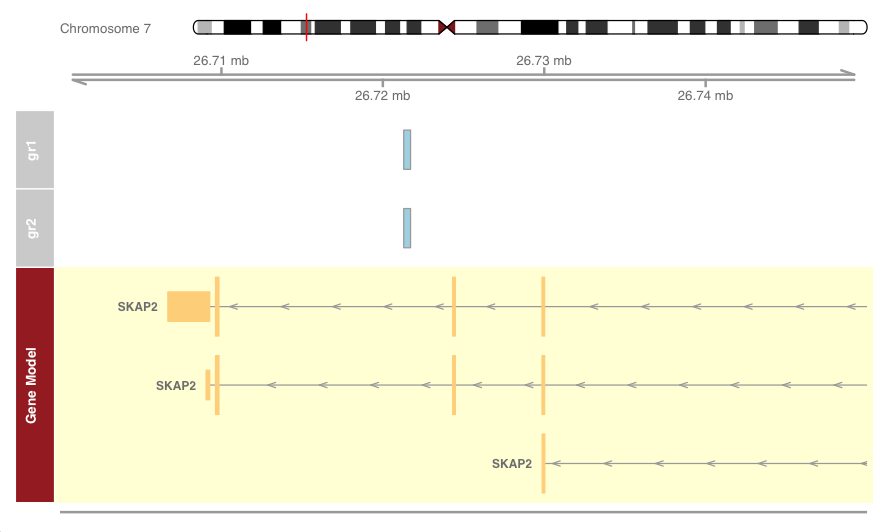
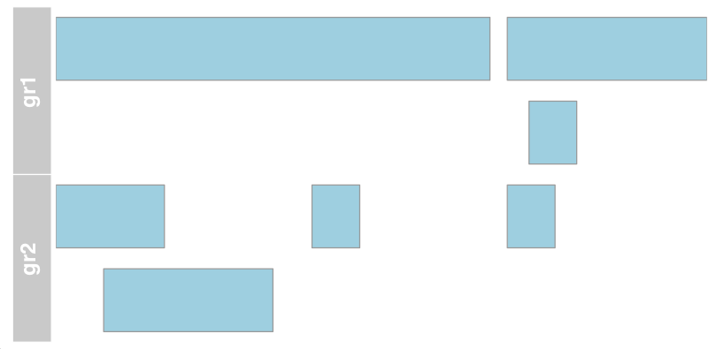

``` r
library(IRanges); library(GenomicRanges); library(CustomBioInfoFunctionsHumanGenome)
```

## 1. Introduction:

This Package contains some customized functions for common operations
used in human genome analysis.

## 2. Availability and Installation

The development version of `CustomBioInfoFunctionsHumanGenome` package
is available at
<https://github.com/vinodsinghjnu/CustomBioInfoFunctionsHumanGenome> and
can be installed as

``` r
# install.packages("devtools")
devtools::install_github("vinodsinghjnu/CustomBioInfoFunctionsHumanGenome",build_vignettes = TRUE )
```

## 3. Functions

### 3.1 addGrInformation

#### **Description**

add assembly information to the genomic range.

#### **Usage**

`addGrInformation(gr.f=gr, assmblyName='hg19')`

#### **Arguments**

-   `gr.f`: A genomic range.
-   `assmblyName`: human genome assembly name i.e., hg19 or hg38 or t2t.
    Default is `hg19`

#### **Details**

This function will add genomic length and assembly name to given genomic
ranges (Human genome only). It will remove the non-standard chromosomes
from genomic ranges and report the bad genomic ranges for the selected
genome assembly.

#### **Value**

returns the input genomic range along with assembly information.

#### **Examples**

``` r
gr <- GRanges(seqnames = "chr1", strand = c("+", "-", "+"),  ranges = IRanges(start = c(1,110,105), end = c(100, 120, 150 )))

outGr=addGrInformation(gr.f=gr, assmblyName='hg19')
outGr
```

    ## GRanges object with 3 ranges and 0 metadata columns:
    ##       seqnames    ranges strand
    ##          <Rle> <IRanges>  <Rle>
    ##   [1]     chr1     1-100      +
    ##   [2]     chr1   110-120      -
    ##   [3]     chr1   105-150      +
    ##   -------
    ##   seqinfo: 24 sequences from 2 genomes (hg19, NA)

### 3.2 pctOverlap_Of_FirstGrToSecondGr

#### **Description**

Percent overlap of a GenomicRange with other

#### **Usage**

`pctOverlap_Of_FirstGrToSecondGr(FirstContext=gr1, SecondContext=gr2)`

#### **Arguments**

-   `FirstContext`: GenomicRange object. (query: overlapped)
-   `SecondContext`: GenomicRange object. (overlapped to)

#### **Details**

Percent overlap of a genomic range with other.

#### **Value**

Percent overlap of first genomic range to second genomic range

#### **Examples**

``` r
gr1 <- GRanges(seqnames = "chr1", strand = c("+", "-", "+"),  ranges = IRanges(start = c(1,110,105), end = c(100, 120, 150 )))

gr2 <- GRanges(seqnames = "chr1", strand = c("+", "-", "+", "+"),  ranges = IRanges(start = c(1,12,60, 105), end = c(25, 50, 70, 115 )))

pctOverlap_Of_FirstGrToSecondGr(FirstContext=gr1, SecondContext=gr2)
```

    ## [1] 45.85987

### 3.3 emptyChrGranges

#### **Description**

Create empty chromosome GenomicRange object for a given human genome
assembly

#### **Usage**

`emptyChrGranges(assmblyName='hg19'))`

#### **Arguments**

-   `assmblyName`: hg19 or hg38 or t2t

#### **Details**

Create empty chromosome GenomicRange object for a given human genome
assembly

#### **Value**

Create empty chromosome GenomicRange object for a given human genome
assembly

Note: Output object is labelled with assembly information.

#### **Examples**

``` r
hg_19_Chr.gr=emptyChrGranges('hg19')
head(hg_19_Chr.gr)
```

    ## GRanges object with 6 ranges and 1 metadata column:
    ##       seqnames      ranges strand |                    Seqs
    ##          <Rle>   <IRanges>  <Rle> |          <DNAStringSet>
    ##   [1]     chr1 1-249250621      * | NNNNNNNNNN...NNNNNNNNNN
    ##   [2]     chr2 1-243199373      * | NNNNNNNNNN...NNNNNNNNNN
    ##   [3]     chr3 1-198022430      * | NNNNNNNNNN...NNNNNNNNNN
    ##   [4]     chr4 1-191154276      * | NNNNNNNNNN...NNNNNNNNNN
    ##   [5]     chr5 1-180915260      * | NNNNNNNNNN...NNNNNNNNNN
    ##   [6]     chr6 1-171115067      * | NNNNNNNNNN...NNNNNNNNNN
    ##   -------
    ##   seqinfo: 24 sequences from hg19 genome

### 3.4 getGbins

#### **Description**

Create GenomicRanges object of given the bin size for human genome.

#### **Usage**

`getGbins(assmblyName='hg19', binSize=1000 )`

#### **Arguments**

-   `assmblyName`: hg19 or hg38 0r t2t
-   `binSize`: size of the genomic block
-   `chrName`: name of the chromosome, if not given then all chromosomes
    are considered (UCSC format)

#### **Details**

Create GenomicRanges object of given the bin size for human genome.

#### **Value**

GenomicRanges object of given the bin size

Note: Output object is labelled with assembly information.

#### **Examples**

``` r
hg_19_Bins.gr=getGbins(assmblyName='hg19', binSize=1000 )
```

``` r
head(hg_19_Bins.gr)
```

    ## GRanges object with 6 ranges and 1 metadata column:
    ##       seqnames    ranges strand | CpG_counts
    ##          <Rle> <IRanges>  <Rle> |  <numeric>
    ##   [1]     chr1    1-1000      * |          0
    ##   [2]     chr1 1001-2000      * |          0
    ##   [3]     chr1 2001-3000      * |          0
    ##   [4]     chr1 3001-4000      * |          0
    ##   [5]     chr1 4001-5000      * |          0
    ##   [6]     chr1 5001-6000      * |          0
    ##   -------
    ##   seqinfo: 24 sequences from hg19 genome

### 3.5 DNASeqsForPattern

#### **Description**

Generate all possible DNA sequences of a [Ambiguous nucleotide
sequence](https://genomevolution.org/wiki/index.php/Ambiguous_nucleotide)

#### **Usage**

`DNASeqsForPattern(pat='NYYN')`

#### **Arguments**

-   `pat`: a [ambiguous nucleotide
    sequence](https://genomevolution.org/wiki/index.php/Ambiguous_nucleotide)

#### **Details**

Generate all possible DNA sequences of a [Ambiguous nucleotide
sequence](https://genomevolution.org/wiki/index.php/Ambiguous_nucleotide)

#### **Value**

A vector of all possible DNA sequences for a given Ambiguous nucleotide
sequence

#### **Examples**

``` r
DNA_seqs=DNASeqsForPattern(pat='NYYN')
DNA_seqs
```

    ##  [1] "ACCA" "CTTC" "GCCG" "TTTT" "ATCA" "CCTC" "GTCG" "TCTT" "ACTA" "CTCC"
    ## [11] "GCTG" "TTCT" "ATTA" "CCCC" "GTTG" "TCCT" "ACCC" "CTTG" "GCCT" "TTTA"
    ## [21] "ATCC" "CCTG" "GTCT" "TCTA" "ACTC" "CTCG" "GCTT" "TTCA" "ATTC" "CCCG"
    ## [31] "GTTT" "TCCA" "ACCG" "CTTT" "GCCA" "TTTC" "ATCG" "CCTT" "GTCA" "TCTC"
    ## [41] "ACTG" "CTCT" "GCTA" "TTCC" "ATTG" "CCCT" "GTTA" "TCCC" "ACCT" "CTTA"
    ## [51] "GCCC" "TTTG" "ATCT" "CCTA" "GTCC" "TCTG" "ACTT" "CTCA" "GCTC" "TTCG"
    ## [61] "ATTT" "CCCA" "GTTC" "TCCG"

### 3.6 createDir_delIfExists

#### **Description**

create a directory and delete if it already exists

#### **Usage**

`createDir_delIfExists(dir='testDir')`

#### **Arguments**

-   `dir`: Name of the dir to be created

#### **Details**

create a directory and delete if it already exists

#### **Value**

Create a directory of given name. (It will delete the directory if it is
already existing there)

#### **Examples**

``` r
createDir_delIfExists(dir='testDir')
```

    ## Old Directory has been deletedNew Directory has been created

``` r
dir.exists('testDir')
```

    ## [1] TRUE

### 3.7 context_oligonucsCounts

#### **Description**

oligo-nucleotide counts in within a genomic context.

#### **Usage**

`context_oligonucsCounts(contextGr=hg_38_gr, oligoType='trinucs', ignore.strand=FALSE, assmblyName='hg38')`

#### **Arguments**

-   `contextGr`: GenomicRange object of the genomic context within which
    oligo-nucleotides has to be counted.
-   `oligoType`: dinucs or trinucs or tetranucs
-   `ignore.strand`: genomic context strand information should be
    considered. Default: FALSE
-   `assmblyName`: human genome assembly name (hg19 or hg38). Default:
    hg19

#### **Details**

oligo-nucleotide counts in within a genomic context.

#### **Value**

a vector of oligo-nucleotide counts

#### **Examples**

``` r
data(hg_38_gr)

oligonucs.Counts=context_oligonucsCounts(contextGr=hg_38_gr, oligoType='trinucs', ignore.strand=FALSE, assmblyName='hg38')

oligonucs.Counts
```

    ##     AAA     AAC     AAG     AAT     ACA     ACC     ACG     ACT     AGA     AGC 
    ## 1325123  507680  697059  857418  698085  401071   87610  563602  766871  484544 
    ##     AGG     AGT     ATA     ATC     ATG     ATT     CAA     CAC     CAG     CAT 
    ##  615364  563602  706620  461672  634677  857418  649772  517039  700902  634677 
    ##     CCA     CCC     CCG     CCT     CGA     CGC     CGG     CGT     CTA     CTC 
    ##  630048  447455   94106  615364   76306   81429   94106   87610  451366  581037 
    ##     CTG     CTT     GAA     GAC     GAG     GAT     GCA     GCC     GCG     GCT 
    ##  700902  697059  685228  326166  581037  461672  496828  405020   81429  484544 
    ##     GGA     GGC     GGG     GGT     GTA     GTC     GTG     GTT     TAA     TAC 
    ##  533465  405020  447455  401071  399481  326166  517039  507680  727231  399481 
    ##     TAG     TAT     TCA     TCC     TCG     TCT     TGA     TGC     TGG     TGT 
    ##  451366  706620  677442  533465   76306  766871  677442  496828  630048  698085 
    ##     TTA     TTC     TTG     TTT 
    ##  727231  685228  649772 1325123

### 3.9 getPromGRange

#### **Description**

Get genomic range of ProteinCodingGenes promoters (upst to -200)

#### **Usage**

`getPromGRange(upst = 500, assmblyName)`

#### **Arguments**

-   `upst`: Upstream of the promoter. Promoter region will be “upst” to
    -200 to TSS. DEFAULT value is 500
-   `assmblyName`: human genome assembly name (hg19 or hg38). Default:
    hg19

#### **Value**

genomic ranges for protein coding genes and their promoter for a give
assembly.

#### **Examples**

``` r
outGr=getPromGRange(upst=500, assmblyName='hg19')
```

    ## 'select()' returned many:many mapping between keys and columns

``` r
outGr$proteinCoding.proms
```

    ## GRanges object with 18918 ranges and 2 metadata columns:
    ##          seqnames            ranges strand |     gene_id
    ##             <Rle>         <IRanges>  <Rle> | <character>
    ##    79501     chr1       68591-69290      + |       79501
    ##   729759     chr1     367159-367858      + |      729759
    ##   148398     chr1     860030-860729      + |      148398
    ##   339451     chr1     895467-896166      + |      339451
    ##    84069     chr1     901377-902076      + |       84069
    ##      ...      ...               ...    ... .         ...
    ##     1617     chrY 25345055-25345754      - |        1617
    ##    57135     chrY 26959440-26960139      - |       57135
    ##     9085     chrY 26193962-26194661      - |        9085
    ##    57054     chrY 26959440-26960139      - |       57054
    ##     9083     chrY 27198052-27198751      - |        9083
    ##                                  GenesMap
    ##                              <data.frame>
    ##    79501   79501:OR4F5:protein-coding:...
    ##   729759 729759:OR4F29:protein-coding:...
    ##   148398 148398:SAMD11:protein-coding:...
    ##   339451 339451:KLHL17:protein-coding:...
    ##    84069 84069:PLEKHN1:protein-coding:...
    ##      ...                              ...
    ##     1617     1617:DAZ1:protein-coding:...
    ##    57135    57135:DAZ4:protein-coding:...
    ##     9085     9085:CDY1:protein-coding:...
    ##    57054    57054:DAZ3:protein-coding:...
    ##     9083     9083:BPY2:protein-coding:...
    ##   -------
    ##   seqinfo: 24 sequences from hg19 genome

``` r
outGr$proteinCoding.genes
```

    ## GRanges object with 18918 ranges and 2 metadata columns:
    ##          seqnames            ranges strand |     gene_id
    ##             <Rle>         <IRanges>  <Rle> | <character>
    ##    79501     chr1       69091-70008      + |       79501
    ##   729759     chr1     367659-368597      + |      729759
    ##   148398     chr1     860530-879961      + |      148398
    ##   339451     chr1     895967-901099      + |      339451
    ##    84069     chr1     901877-910484      + |       84069
    ##      ...      ...               ...    ... .         ...
    ##     1617     chrY 25275502-25345254      - |        1617
    ##    57135     chrY 25275502-26959639      - |       57135
    ##     9085     chrY 26191377-26194161      - |        9085
    ##    57054     chrY 26909216-26959639      - |       57054
    ##     9083     chrY 27177050-27198251      - |        9083
    ##                                  GenesMap
    ##                              <data.frame>
    ##    79501   79501:OR4F5:protein-coding:...
    ##   729759 729759:OR4F29:protein-coding:...
    ##   148398 148398:SAMD11:protein-coding:...
    ##   339451 339451:KLHL17:protein-coding:...
    ##    84069 84069:PLEKHN1:protein-coding:...
    ##      ...                              ...
    ##     1617     1617:DAZ1:protein-coding:...
    ##    57135    57135:DAZ4:protein-coding:...
    ##     9085     9085:CDY1:protein-coding:...
    ##    57054    57054:DAZ3:protein-coding:...
    ##     9083     9083:BPY2:protein-coding:...
    ##   -------
    ##   seqinfo: 24 sequences from hg19 genome

### 3.10 Gbin_ByCGcnts

#### **Description**

Create a GenomicRange of genomic blocks of user specified CpG counts.
(human genome)

#### **Usage**

`Gbin_ByCGcnts(CGs_perBin=100, assmblyName='hg19' )`

#### **Arguments**

-   `assmblyName`: hg19 or hg38 or t2t
-   `CGs_perBin`: CpG counts in a genomic block/bin. (even number)
    oligo-nucleotides has to be counted.
-   `addSeq`: if sequence of the bin is required (Default: FALSE)

#### **Details**

Creates a GenomicRange of genomic blocks of user specified CpG counts.
(human genome)

#### **Value**

GenomicRanges object of bins with user specified CpG counts

#### **Examples**

``` r
hg_19_CpGBins.gr=Gbin_ByCGcnts(CGs_perBin=100, assmblyName='hg19' )
hg_19_CpGBins.gr
```

    ## GRanges object with 564328 ranges and 0 metadata columns:
    ##            seqnames            ranges strand
    ##               <Rle>         <IRanges>  <Rle>
    ##        [1]     chr1       10469-10761      *
    ##        [2]     chr1       10766-11094      *
    ##        [3]     chr1       11105-12758      *
    ##        [4]     chr1       12773-15190      *
    ##        [5]     chr1       15207-17585      *
    ##        ...      ...               ...    ...
    ##   [564324]     chrY 59355793-59357713      *
    ##   [564325]     chrY 59357736-59360397      *
    ##   [564326]     chrY 59360409-59361720      *
    ##   [564327]     chrY 59361723-59361953      *
    ##   [564328]     chrY 59361962-59362400      *
    ##   -------
    ##   seqinfo: 24 sequences from hg19 genome

### 3.11 largeVariables

#### **Description**

Memory usage of large variable in workspace

#### **Usage**

`largeVariables(n)`

#### **Arguments**

-   `n`: Number of top memory consuming variables required

#### **Details**

Memory of variable in decreasing order

#### **Value**

DataFrame of top memory variables

#### **Examples**

``` r
largeVariables(n=5)
```

    ##                    Class      KB       GB
    ## hg_19_Chr.gr     GRanges 3023145 3.023145
    ## hg_19_Bins.gr    GRanges   48383 0.048383
    ## outGr               list   18654 0.018654
    ## hg_19_CpGBins.gr GRanges    4422 0.004422
    ## hg_38_gr         GRanges     176 0.000176

### 3.12 makeTracks_of_grangesList

#### **Description**

make tracks list from GenomicRange lists.

#### **Usage**

`makeTracks_of_grangesList(grlist, location, assmblyName)`

#### **Arguments**

-   `grlist`: GenomicRange object of the genomic context within which
    oligo-nucleotides has to be counted.
-   `location`: location on the chromosome as List. ie.,
    list(chr=‘chr7’,from=26700000, to=26750000)
-   `assmblyName`: human genome assembly name (hg19 or hg38). Default:
    hg19

#### **Details**

Make tracks from genomic ranges objects list

#### **Value**

list of tracks for input list of genomic ranges objects.

#### **Examples**

``` r
# example 1
data(cpgIslands)

mygrlist=list(gr1=cpgIslands,gr2=cpgIslands)
loc=list(chr='chr7',from=26700000, to=26750000)
tracks=makeTracks_of_grangesList(grlist=mygrlist, location=loc, assmblyName='hg19')
plotTracks(tracks, from = loc$from, to = loc$to)
```




``` r
# example 2, only genomic ranges no annotation
gr1 <- GRanges(seqnames = "chr1", strand = c("+", "-", "+"),  ranges = IRanges(start = c(1,110,105), end = c(100, 120, 150 )))

gr2 <- GRanges(seqnames = "chr1", strand = c("+", "-", "+", "+"),  ranges = IRanges(start = c(1,12,60, 105), end = c(25, 50, 70, 115 )))

plotTracks(makeTracks_of_grangesList(list(gr1=gr1,gr2=gr2), if_plain=TRUE), shape="box")
```



